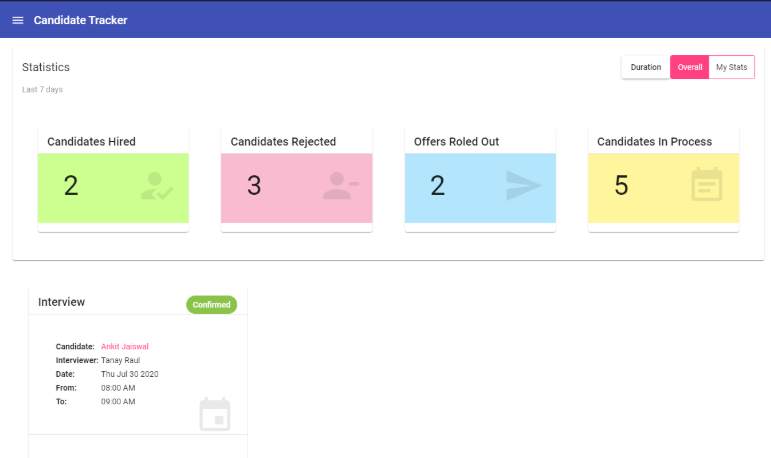
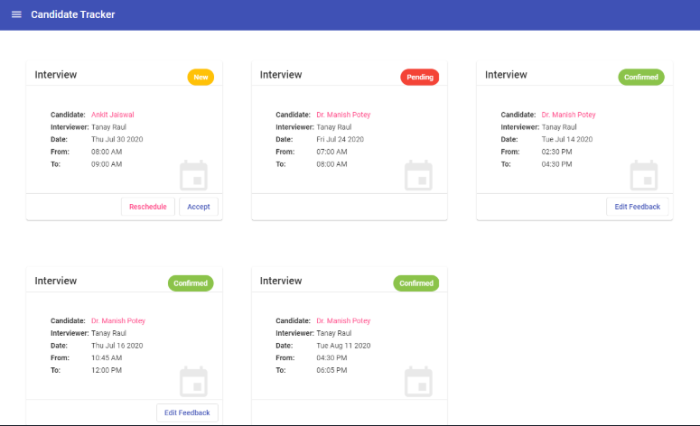
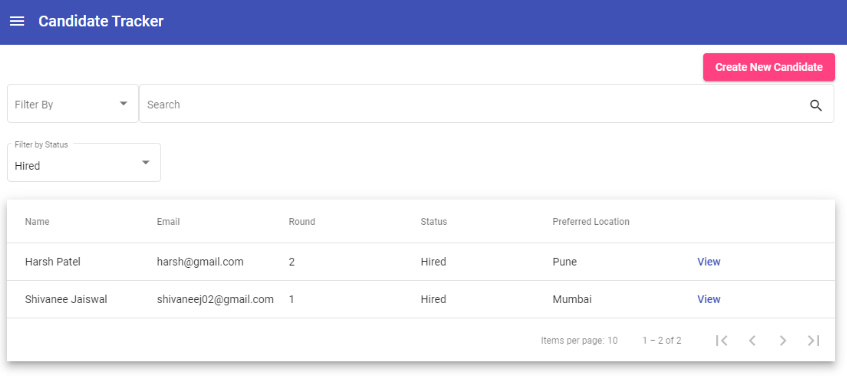
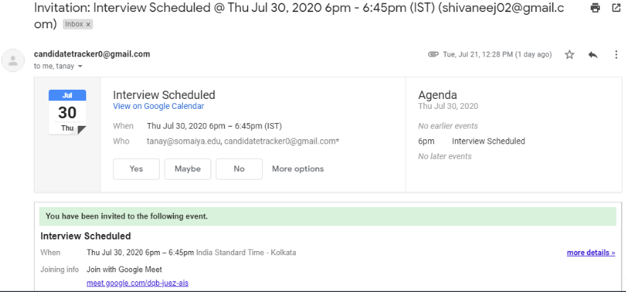

	<h1>Candidate Tracker</h1>

&emsp;
&emsp;
&emsp;
&emsp;
&emsp;

* Candidate Tracker is web-based recruitment platform. It can be used to track profile of candidate and supports end to end recruitment process from picking up a candidate's profile to onboarding of the candidate.

## Features
* Dedicated dashboard for every user role. User role is automatically identified upon successful login.
* JWT based authentication and authorization.
* Support for virtual interview between candidate and interviewer using Google Meet.
* Email notifications for account creation, candidate hired or rejected.
* Calendar invite for interviews scheduled.
* Option to upload candidate CV.
* Search, sort and filter candidates.
* Statistics for custom duration.

## Screenshots
&emsp;
  
&emsp;
 

## Technology Stack
* Java
* Angular 9
* MySQL Database
* Spring Boot
* Gradle

## Repositories
* [Candidate-Tracker-Server](https://github.com/harshpatel23/Candidate-Tracker-Server)
* [Candidate-Tracker-App](https://github.com/shivaneej/Candidate-Tracker-App)

## How To Run
1. Clone the repository with all the submodule 
    `git clone --recurse-submodules <URL here>`
2. Import `database/candidate_tracker_schema` in MySQL Workbench.    
3. Start the Spring Server by running 
    `./Candidate-Tracker-Server/gradlew/bootRun`
4. Navigate to `Candidate-Tracker-App` 
    `cd Candidate-Tracker-App`
4. Install npm dependencies by running 
    `npm install`
5. Start the Application Server by running 
    `ng serve`
6. Open `http://localhost:4200/` in your browser to view the application.

## Contributors
* [Shivanee Jaiswal](https://www.github.com/shivaneej)
* [Harsh Patel](https://github.com/harshpatel23)
* [Hitanshu Shah](https://github.com/hitanshu310)
